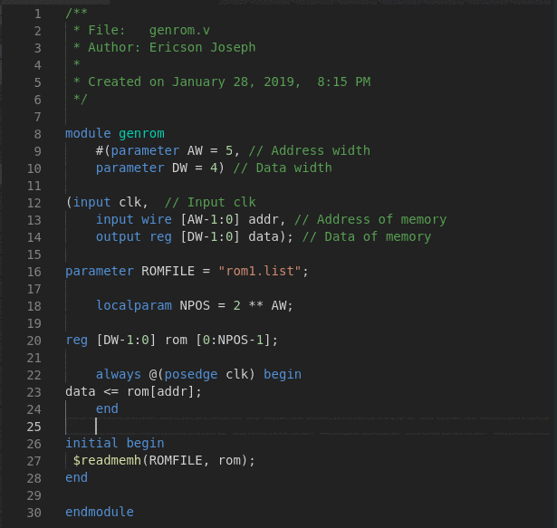

# Verilog Format

Console application for apply format to verilog file.



## How to use

Application options:

```
usage: [java -jar verilog-format.jar|./verilog-format|verilog-format.exe]
       [-f <pathname>] [-h] [-p] [-s <verilog-format.properties>] [-v]
 -f,--format <pathname>                      verilog file
 -h,--help                                   print this message
 -p,--print                                  print file formated
 -s,--settings <verilog-format.properties>   settings config
 -v,--version                                verilog-format version
```

## Examples

```sh
## Print input_file.v formatted
$ ./verilog-format -p -f input_file.v -s verilog-format.properties 

## Format input_file.v
$ ./verilog-format -f input_file.v -s verilog-format.properties

## Format input_file.v
## If .verilog-format.properties exist in project folder, this is used,
## otherwise default setting is used..
$ ./verilog-format -f input_file.v

```

## Install in Linux

1. Clone repository.

    `$ git clone https://github.com/ericsonj/verilog-format.git`

2. Install verilog-format

    `$ cd verilog-format/bin/`  
    `$ sudo mkdir /opt/verilog-format`  
    `$ sudo unzip verilog-format-LINUX.zip -d /opt/verilog-format/`

3. Execute like java  

    `$ java -jar /opt/verilog-format/verilog-format.jar`

4. Execute like linux script  

    `$ /opt/verilog-format/verilog-format`

5. Install in system

    `$ sudo cp /opt/verilog-format/verilog-format /usr/bin/`

## Install in Windows

1. Clone repository or download [verilog-format-WIN.zip](bin/verilog-format-WIN.zip)  

2. Unzip and copy in your preferer folder.

## Build project

For build de project, Maven is needed.  

`$ cd verilog-format`  
`$ mvn clean package`  
`$ ls target/` 

## Verilog-Format Style Options

This options are setting in `.verilog-format.properties` file.

### Example

```properties
## File .verilog-format.properties
IndentWidth=4
IndentType=space
SpacesBeforeTrailingComments=0
SpacesAfterTrailingComments=0
AlignLineComments=true
AlignNoBlockingAssignments=true
AlignBlockingAssignments=true
SpacesInParentheses=false
SpacesInSquareBrackets=false
```

---
### IndentWidth=[number]

```verilog
// IndentWidth=4  #(default)
always @(posedge clk)
    if (load == 1)
        bitc <= 0;
    else if (load == 0 && clk_baud == 1)
        bitc <= bitc + 1;

// IndentWidth=1
always @(posedge clk)
 if (load == 1)
  bitc <= 0;
 else if (load == 0 && clk_baud == 1)
  bitc <= bitc + 1;
```
--- 
### IndentType=[space|tab]
```verilog
// IndentType=space  #(default)
always @(posedge clk)
    if (load == 1)
        bitc <= 0;
    else if (load == 0 && clk_baud == 1)
        bitc <= bitc + 1;

// IndentType=tab  #  not recommended yet
always @(posedge clk)
<tab>if (load == 1)
<tab><tab>bitc <= 0;
<tab>else if (load == 0 && clk_baud == 1)
<tab><tab>bitc <= bitc + 1;
```
---
### SpacesInParentheses=[true|false]
```verilog
// SpacesInParentheses=false  #(default)
always @(posedge clk)
    if (load == 1)

// SpacesInParentheses=true
always @( posedge clk )
    if ( load == 1 )
```
---

### SpacesInSquareBrackets=[true|false]
```verilog
// SpacesInSquareBrackets=false  #(default)
reg [DW-1:0] rom [0:NPOS-1];

always @(posedge clk) begin
    data <= rom[addr];
end

// SpacesInSquareBrackets=true
reg [ DW-1:0 ] rom [ 0:NPOS-1 ];
    
always @(posedge clk) begin
    data <= rom[ addr ];
```
---
### AlignBlockingAssignments=[true|false]
```verilog
// AlignBlockingAssignments=true  #(default)
assign load    = (state == START) ? 1 : 0;
assign baud_en = (state == IDLE) ? 0 : 1;

// AlignBlockingAssignments=false
assign load = (state == START) ? 1 : 0;
assign baud_en = (state == IDLE) ? 0 : 1;

```
---
### AlignNoBlockingAssignments=[true|false]
```verilog
// AlignNoBlockingAssignments=true  #(default)
state_ts   <= IDLE;
state_pad  <= IDLE;
state_wait <= IDLE;

// AlignNoBlockingAssignments=false
state_ts <= IDLE;
state_pad <= IDLE;
state_wait <= IDLE;
```
---
### AlignLineComments=[true|false]
```verilog
// AlignLineComments=false  #(default)
always @(posedge clk) // always
    if (load == 1)  // if
        bitc <= 0; //
    else if (load == 0 && clk_baud == 1) // else if
        bitc <= bitc + 1; //

// AlignLineComments=true
always @(posedge clk)                    // always
    if (load == 1)                       // if
        bitc <= 0;                       //
    else if (load == 0 && clk_baud == 1) // else if
        bitc <= bitc + 1;                //
```
---
### SpacesBeforeTrailingComments=[number]
```verilog
// SpacesBeforeTrailingComments=1  #(default)
localparam IDLE  = 0; //IDLE

// SpacesBeforeTrailingComments=0
localparam IDLE  = 0;//IDLE
```
---
### SpacesAfterTrailingComments=[number]
```verilog
// SpacesAfterTrailingComments=0  #(default)
localparam IDLE  = 0; //IDLE

// SpacesAfterTrailingComments=3
localparam IDLE  = 0; //   IDLE
```
---
